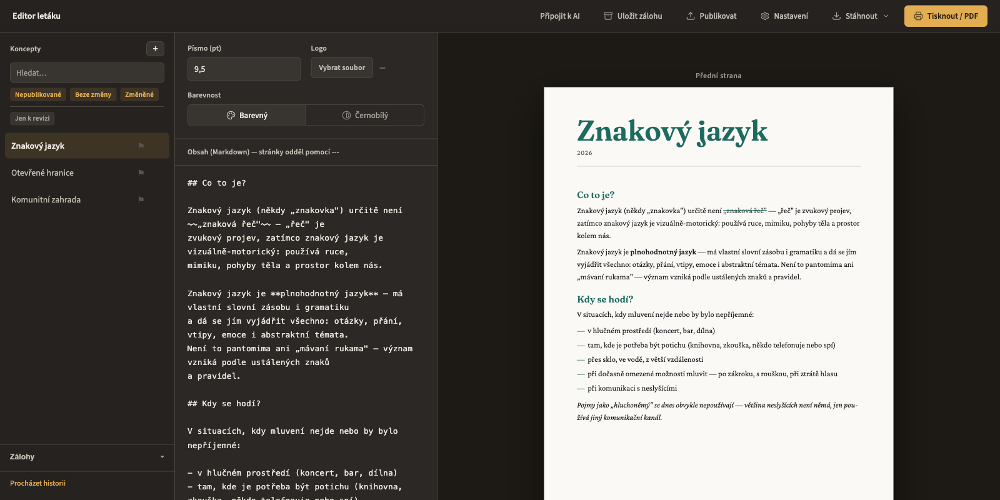

# Editor letáku

Prohlížečový editor A5 letáků: Markdown na vstupu, tiskové PDF, HTML nebo PNG na
výstupu. Local-first — data žijí v prohlížeči (Evolu/SQLite) a synchronizují se mezi
zařízeními přes mnemonickou frázi. Žádný vlastní server.

**Živá verze:** https://nktrjsk.github.io/flyer-editor/



## Funkce

- Živý A5 náhled s indikací přetečení (co se nevejde, se nevytiskne — a je to vidět)
- Automatické zálohy s historií a diffem, s možností obnovy
- Barevná i černobílá varianta letáku
- Logo na přední straně
- Export do PNG/JPEG, samostatný HTML soubor, tisk/PDF přes dialog prohlížeče
- Publikování hotových letáků do git repozitáře
- Synchronizace mezi zařízeními přes Evolu (mnemonická fráze v Nastavení)
- Lokální AI bridge pro Claude — návrhy úprav letáku vždy schvaluje člověk, běží
  jen lokálně (viz [`docs/ai-bridge.md`](https://github.com/nktrjsk/flyer-editor/blob/main/docs/ai-bridge.md))

## Spuštění

```bash
npm install
npm run dev       # http://localhost:5173/flyer-editor/
npm run build     # tsc -b && vite build → dist/
npm run preview   # produkční build lokálně
```

## Architektura

React 19 + TypeScript + Vite 6, žádný backend. Evolu ukládá data do SQLite ve
WebAssembly přímo v prohlížeči a stará se o synchronizaci; `marked` převádí
Markdown na HTML, `html-to-image` dělá screenshoty a export náhledu. Evolu
potřebuje `SharedArrayBuffer`, což vyžaduje COOP/COEP hlavičky — GitHub Pages je
neumí nastavit, proto je vpravuje `coi-serviceworker` na klientovi. Mapa kódu je
v [`CLAUDE.md`](https://github.com/nktrjsk/flyer-editor/blob/main/CLAUDE.md), vizuální systém v [`DESIGN.md`](https://github.com/nktrjsk/flyer-editor/blob/main/DESIGN.md), produktový
záměr v [`PRODUCT.md`](https://github.com/nktrjsk/flyer-editor/blob/main/PRODUCT.md).

## Nasazení

Push do `main` spustí GitHub Actions (`.github/workflows/deploy.yml`), který
zbuildí projekt a publikuje `dist/` na GitHub Pages.

## Licence

MIT.
